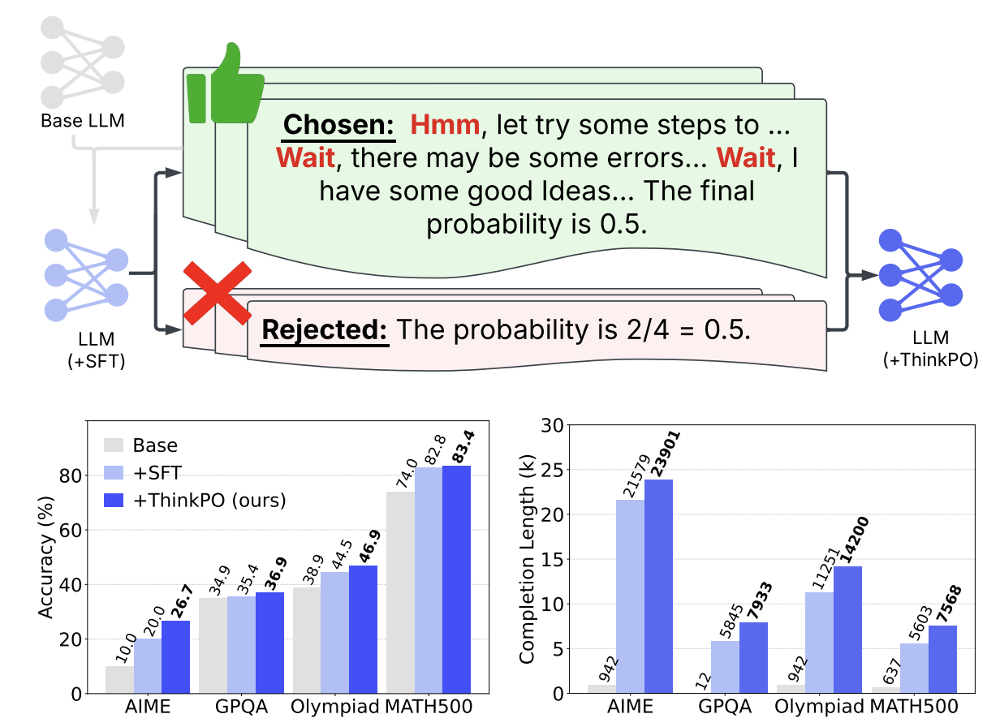

# ThinkPO: Thinking Preference Optimization
> a simple yet effective postSFT method that enhances long CoT reasoning without requiring new long CoT responses

<p align="center">
  
</p>

---
# News
- 2025-02-22: We released our ThinkPO dataset: [Bespoke_dpo_filter](https://huggingface.co/datasets/VanWang/Bespoke_dpo_filter)
- 2025-02-21: We released our four models:
  - [DeepSeek-R1-Distill-Qwen-7B-ThinkPO](https://huggingface.co/VanWang/DeepSeek-R1-Distill-Qwen-7B-ThinkPO)
  - [Bespoke-Stratos-7B-ThinkPO](https://huggingface.co/VanWang/Bespoke-Stratos-7B-ThinkPO)
  - [Bespoke-Stratos-7B-repro-SFT](https://huggingface.co/VanWang/Bespoke-Stratos-7B-repro-SFT)
  - [Bespoke-Stratos-7B-repro-ThinkPO](https://huggingface.co/VanWang/Bespoke-Stratos-7B-repro-ThinkPO)

- 2025-02-19: We released our [paper](https://arxiv.org/abs/2502.13173).

---
# Introduction
- Here, we show the results of open-source reasoning LLMs before and after ThinkPO.
## Accuracy

| Models | Dataset   | SFT | Ours (+ThinkPO) | Improv. (%) |
|:--------:|:--------:|:--------:|:--------:|:--------:|
|DeepSeek-R1-Distill-Qwen-7B (Deepseek)  |MATH500   | 87.4          | 91.2           | 4.3%        |
|| AIME      | 56.7      | 43.3           | -23.6%     |
|| GPQA      | 47.0          | 49.5           | 5.3%        |
|| GSM8K     | 87.2          | 87.6           | 0.5%        |
|| Olympiad  | 58.6          | 58.6           | 0.0%        |
|Bespoke-Stratos-7B (Bespoke)| MATH500   | 84.0         | 82.8           | -1.4%       |
|| AIME      | 20.0         | 23.3           | 16.5%       |
|| GPQA      | 37.9         | 43.4           | 14.5%       |
|| GSM8K     | 92.9         | 93.3           | 0.4%        |
|| Olympiad  | 44.1         | 48.5           | 10.0%       |

## Average Response Length

| Model | Dataset   | SFT | Ours (+ThinkPO) | Improv. (%) |
|:--------:|:--------:|:--------:|:--------:|:--------:|
|DeepSeek-R1-Distill-Qwen-7B (Deepseek) | MATH500   | 2577          | 3021           | 17.2%       |
|| AIME      | 11419         | 12875          | 12.8%       |
|| GPQA      | 4895          | 5604           | 14.5%       |
|| GSM8K     | 619           | 668            | 7.9%        |
|| Olympiad  | 7196          | 7383           | 2.6%        |
|Bespoke-Stratos-7B (Bespoke)| MATH500   | 5696         | 6404           | 12.4%       |
|| AIME      | 19858        | 20079          | 1.1%        |
|| GPQA      | 5968         | 7301           | 22.3%       |
|| GSM8K     | 1404         | 1755           | 25.0%       |
|| Olympiad  | 11140        | 12204          | 9.6%        |

---
# Quick Use
## Settting
- in ./utils/settings.py, you could set your project path, huggingface cache path and token
```python
project_dir = 'path to your project'
cache_dir = 'path to huggingface cache'
hug_token = 'your huggingface token'
```

## SFT Train
- if you wanna use multi-gpus to train Qwen2.5-7B-Instruct with SFT, you could use the following command:
```shell
cd train
deepspeed sft_train.py --model_name Instruct-7b --gradient_accumulation_steps 16 --dataset_name Bespoke --epoch 3 --lr 1e-5 --deepspeed ./deepseed/zero3_config2.json
```

## ThinkPO Train
- if you wanna use multi-gpus to train Qwen2.5-7B-Instruct with ThinkPO, you could use the following command:
```shell
cd train
deepspeed dpo_train.py --lr 3e-7 --beta 0.01 --model Bespoke-7b --dataset Bespoke_dpo --gradient_accumulation_steps 12 --deepspeed ./deepseed/zero3_config2.json
```

## eval the model
- The LLM Reasoning Evaluation refers to [Sky-Thought](https://github.com/NovaSky-AI/SkyThought/tree/main)
- you could use the following command to evaluate the model, like datasets MATH500,AIME,GPQADiamond,GSM8K,OlympiadBenchMath
```shell
cd ./tools
python ./eval.py \
    --model deepseek-ai/DeepSeek-R1-Distill-Qwen-7B \
    --evals MATH500,AIME,GPQADiamond,GSM8K,OlympiadBenchMath \
    --tp 2 --output_file ./results/eval/DeepSeek-R1-Distill-Qwen-7B.txt \
    --result_dir ./results/generated
```

## citation
```bibtex
@misc{yang2025thinkingpreferenceoptimization,
      title={Thinking Preference Optimization}, 
      author={Wang Yang and Hongye Jin and Jingfeng Yang and Vipin Chaudhary and Xiaotian Han},
      year={2025},
      eprint={2502.13173},
      archivePrefix={arXiv},
      primaryClass={cs.LG},
      url={https://arxiv.org/abs/2502.13173}, 
}
```
