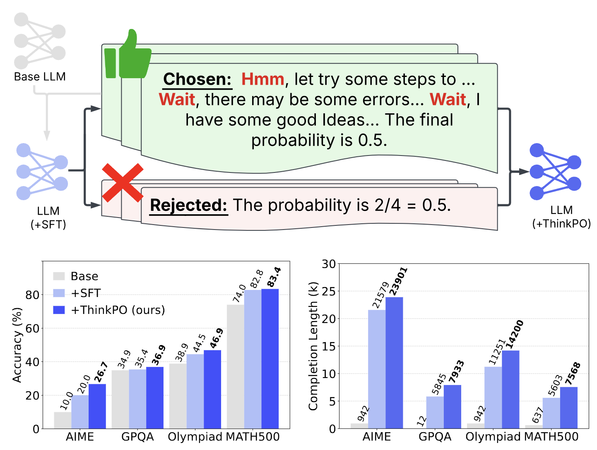

# ThinkPO: Thinking Preference Optimization
> a simple yet effective postSFT method that enhances long CoT reasoning without requiring new long CoT responses



---
# News
- 2025-02-21: We released our four models: [DeepSeek-R1-Distill-Qwen-7B-ThinkPO](https://huggingface.co/VanWang/DeepSeek-R1-Distill-Qwen-7B-ThinkPO), [Bespoke-Stratos-7B-ThinkPO](https://huggingface.co/VanWang/Bespoke-Stratos-7B-ThinkPO),
[Bespoke-Stratos-7B-repro-SFT](https://huggingface.co/VanWang/Bespoke-Stratos-7B-repro-SFT), [Bespoke-Stratos-7B-repro-ThinkPO](https://huggingface.co/VanWang/Bespoke-Stratos-7B-repro-ThinkPO)

- 2025-02-19: We released our [paper](https://arxiv.org/abs/2502.13173).

---
# Quick Use

## SFT Train
- if you wanna use multi-gpus to train Qwen2.5-7B-Instruct with SFT, you could use the following command:
```shell
deepspeed train/sft_train.py --model_name Instruct-7b --gradient_accumulation_steps 16 --dataset_name Bespoke --epoch 3 --lr 1e-5
```

## ThinkPO Train
- if you wanna use multi-gpus to train Qwen2.5-7B-Instruct with ThinkPO, you could use the following command:
```shell
deepspeed train/dpo_train.py --lr 3e-7 --beta 0.01 --model Bespoke-7b --dataset Bespoke_dpo --gradient_accumulation_steps 12
```

## eval the model
- The LLM Reasoning Evaluation refers to [Sky-Thought](https://github.com/NovaSky-AI/SkyThought/tree/main)
- you could use the following command to evaluate the model, like datasets MATH500,AIME,GPQADiamond,GSM8K,OlympiadBenchMath
```shell
cd ./tools
python ./eval.py \
    --model deepseek-ai/DeepSeek-R1-Distill-Qwen-7B \
    --evals MATH500,AIME,GPQADiamond,GSM8K,OlympiadBenchMath \
    --tp 1 --output_file ./results/eval/DeepSeek-R1-Distill-Qwen-7B.txt \
    --result_dir ./results/generated
```

## citation
```bibtex
@misc{yang2025thinkingpreferenceoptimization,
      title={Thinking Preference Optimization}, 
      author={Wang Yang and Hongye Jin and Jingfeng Yang and Vipin Chaudhary and Xiaotian Han},
      year={2025},
      eprint={2502.13173},
      archivePrefix={arXiv},
      primaryClass={cs.LG},
      url={https://arxiv.org/abs/2502.13173}, 
}
```